# Microservices Docker Compose Project (Skill Test 1: Cloud and Containers)

---

## Overview

This project demonstrates a **microservices architecture** using Node.js, fully containerized with Docker and orchestrated using Docker Compose.

### Services

* User Service → `3000`
* Product Service → `3001`
* Order Service → `3002`
* Gateway Service → `3003`

---

## Architecture

```text
Client → Gateway Service → (User | Product | Order Services)
```

---

## Project Structure

```bash
skilltest1/
├── submissions/
│   ├── user-service/
│   ├── product-service/
│   ├── order-service/
│   ├── gateway-service/
├── docker-compose.yml
└── README.md
└── .gitignore
```

---

## Tech Stack

* Node.js
* Docker
* Docker Compose
* Express.js

---

## Getting Started

### Prerequisites

* Docker
* Docker Compose

Check installation:

```bash
docker --version
docker-compose --version
```

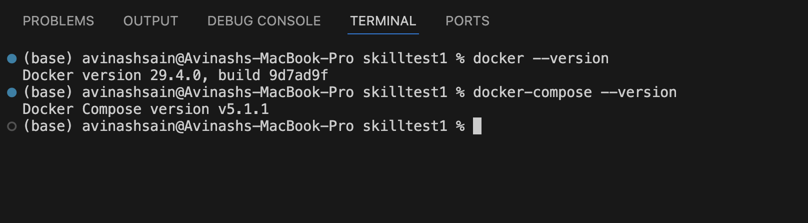

---

### Run the Project

```bash
docker-compose up --build
```

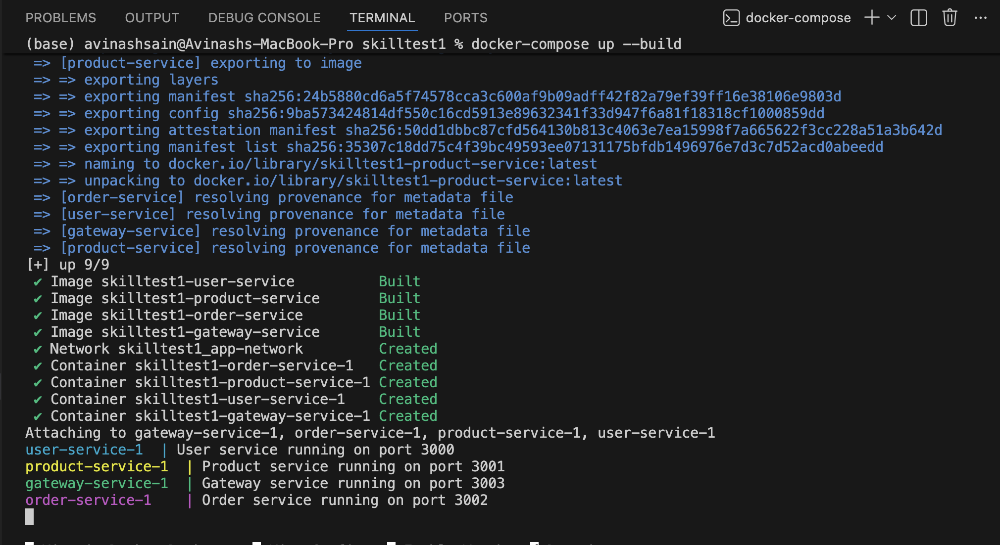

---

### Verify Running Containers

```bash
docker ps
```

---

## Service Endpoints

| Service         | URL                   |
| --------------- | --------------------- |
| User Service    | http://localhost:3000 |
| Product Service | http://localhost:3001 |
| Order Service   | http://localhost:3002 |
| Gateway Service | http://localhost:3003 |

---

## Testing

### Browser

Open:

```
http://localhost:3000
http://localhost:3001
http://localhost:3002
http://localhost:3003
```

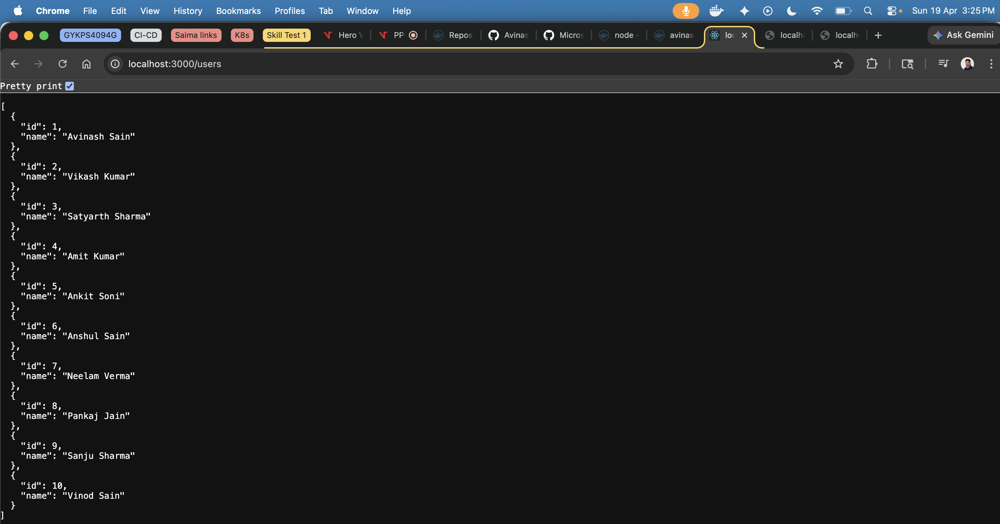
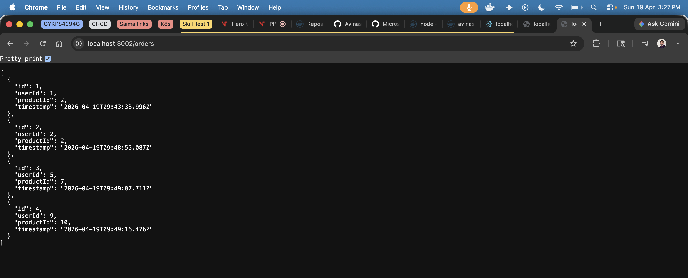
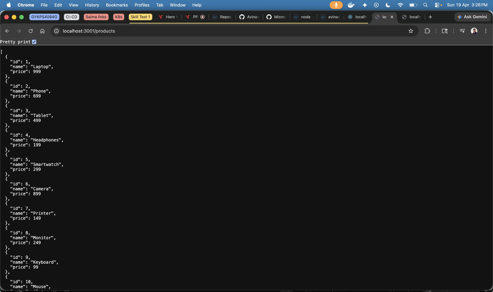
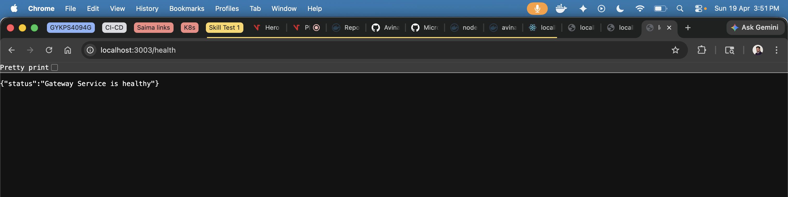
### cURL

```bash
curl http://localhost:3000
curl http://localhost:3001
curl http://localhost:3002
curl http://localhost:3003
```

---

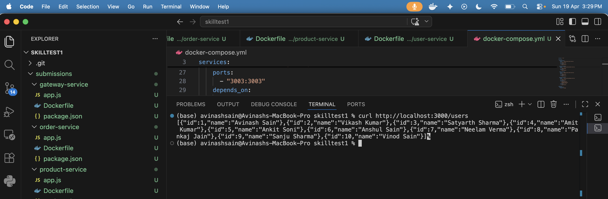
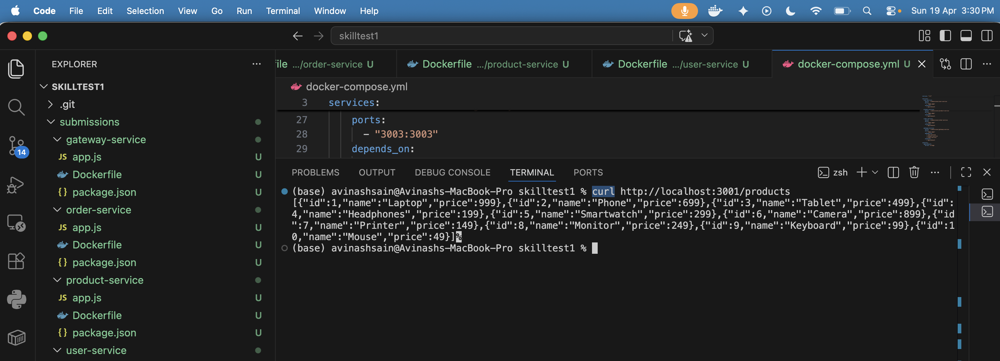
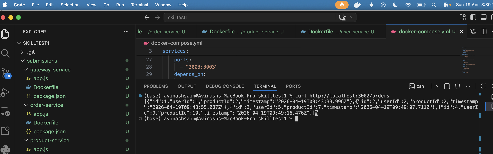
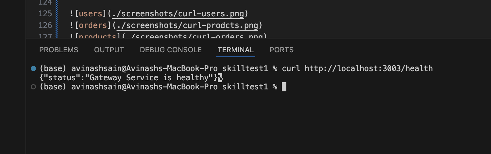

## Docker Setup

### Dockerfiles

Each service:

* Uses Node.js base image
* Installs dependencies
* Exposes port
* Runs with `node app.js`

---

### Docker Compose

* Multi-container orchestration
* Shared bridge network
* Service dependency handling

---

## Screenshots

### Docker Compose Running


### Running Containers

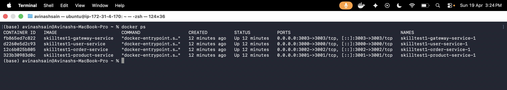

### Browser Output


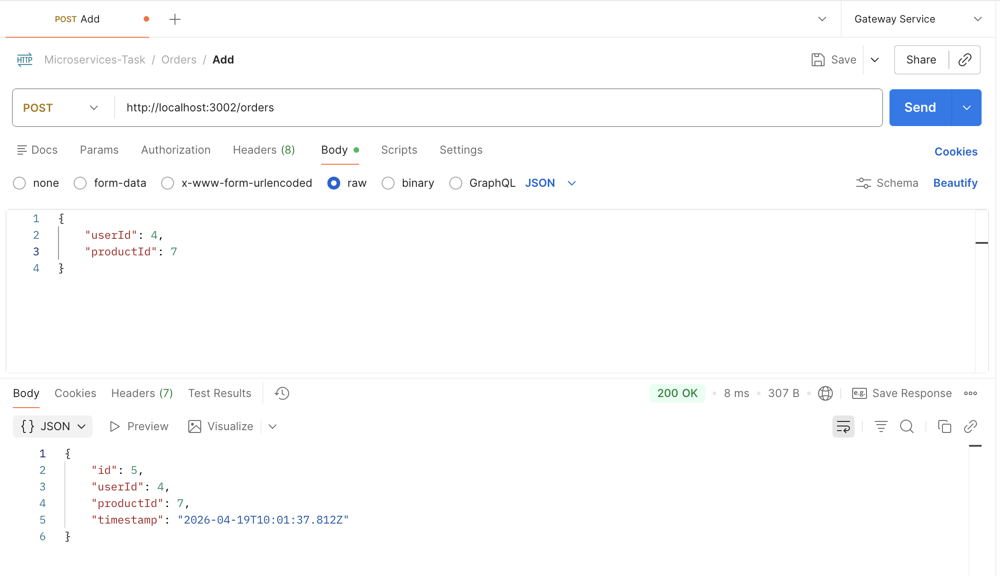

### Project Structure

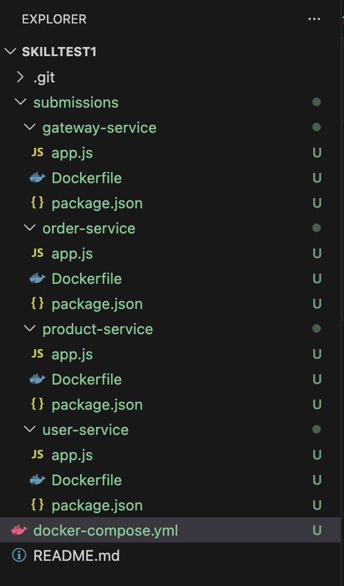

### Postman Collection

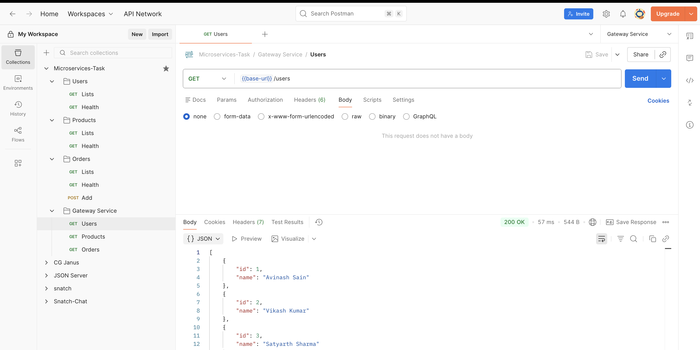
---

## Troubleshooting

### Port already in use

```bash
lsof -i :3000
kill -9 <PID>
```

---

### Check logs

```bash
docker-compose logs
```

---

### Rebuild containers

```bash
docker-compose down
docker-compose up --build
```

---

## Improvements (Future Scope)

* API Gateway routing
* Authentication (JWT)
* Logging & Monitoring

---

## Author

**Avinash Sain**
GitHub: https://github.com/Avinashsain